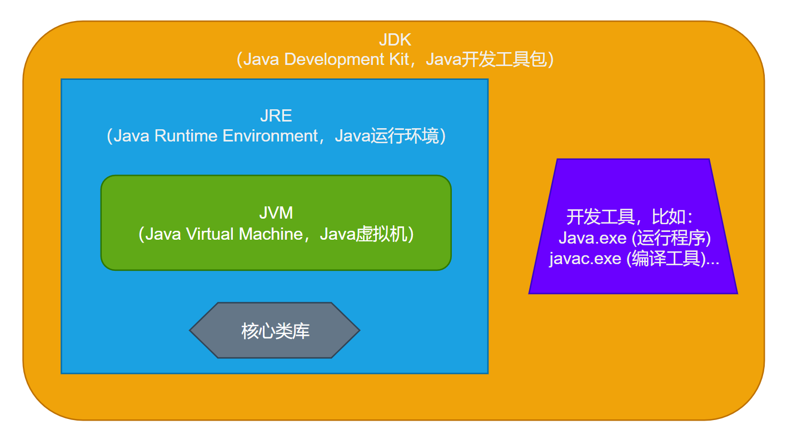

## JVM、JRE、JDK之间的关系

`JVM`是**`Java`虚拟机**，**负责将`Java`字节码解释执行或者编译成本地机器代码**，以便在特定平台上执行`Java`程序。

`JRE`是**`Java`程序运行时的环境**，**包含了`JVM`以及`Java`程序运行所需的核心类库和支持文件**。

`JDK`是**`Java`的开发工具包**，是**`Java`开发人员编写、编译和调试`Java`程序所需的工具集合**，包含了`JRE`以及用于开发`Java`程序的编译器（`javac`）、调试器（`jdb`）、文档生成器（`javadoc`）等工具。

> 总结：
>
> `JDK`包含了`JRE`，而`JRE`包含了`JVM`。
>
> 在开发Java程序时，需要安装`JDK`来进行开发，而在运行`Java`程序时，只需要安装`JRE`即可。

## 