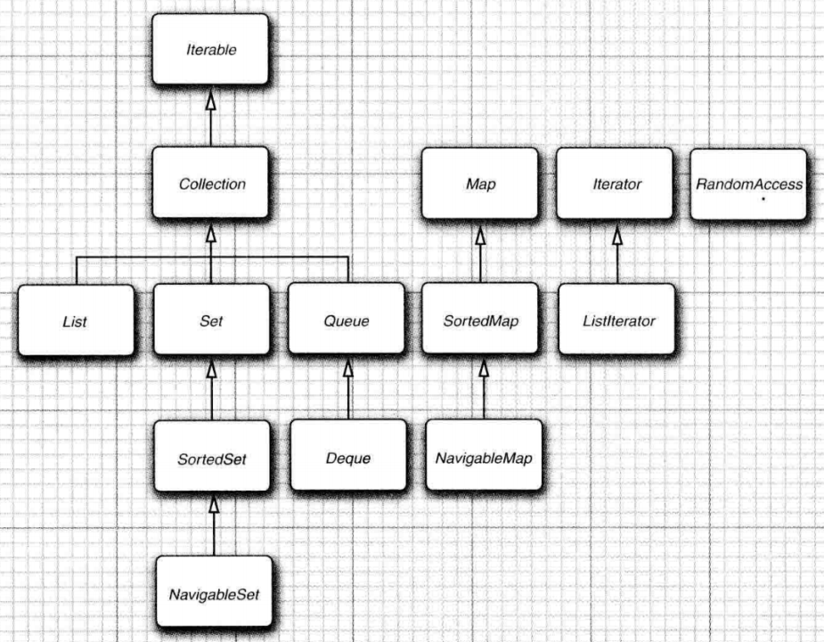
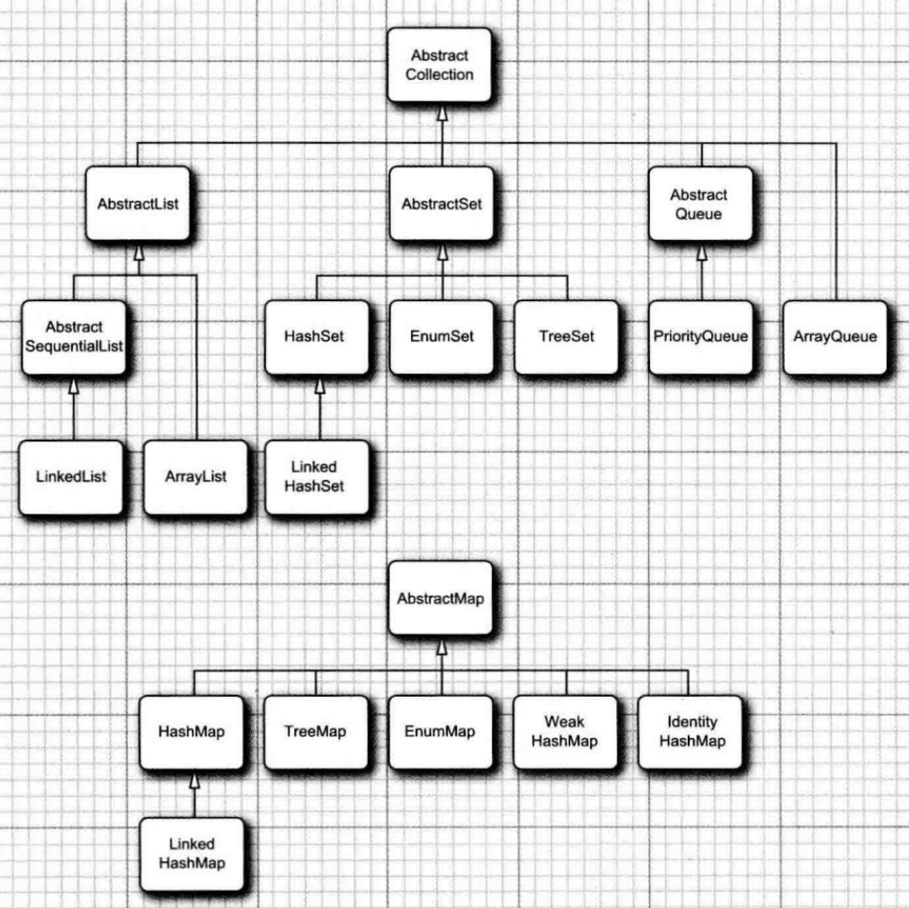
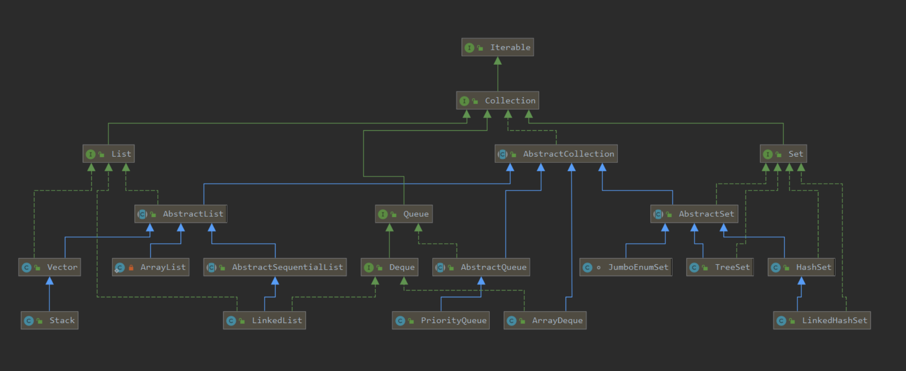
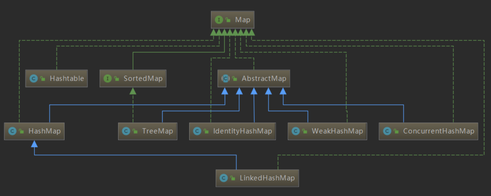
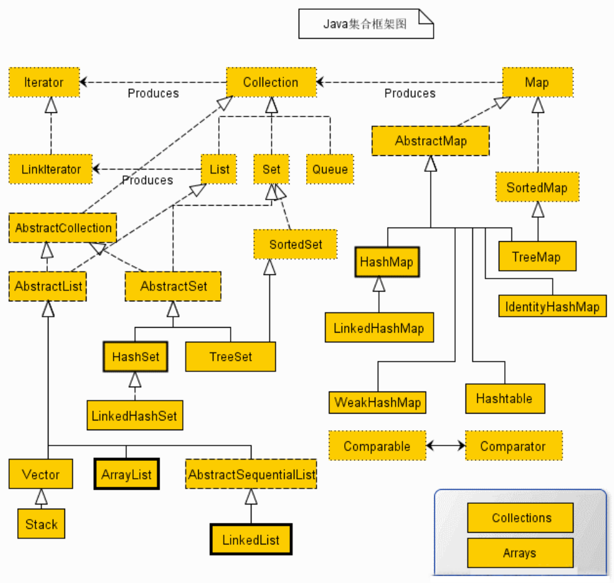

## 谈谈Java集合框架

所有集合都位于`java.util`包下，集合框架都包含三⼤块内容：

- 对外的接⼝
- 接⼝的实现
- 对集合运算的算法

其中：

- **接口**是代表集合的抽象数据类型，比如 `Collection`接口和`Map`接口是Java集合的基本接口，所有的实现类都是这两个接口派生出来的。之所以定义多个接⼝，是为了以不同的⽅式操作集合对象。比如 `Collection`一次存一个元素，而`Map`则是存储一对元素，含有键与值的映射关系在里头。
- **实现（类）**是集合接口的具体实现，比如 `ArrayList`、`LinkedList`、`HashSet`、`HashMap`。
- **算法**是对集合中的对象执行一些特定的操作，比如搜索，排序等。

> 还有一层**中间抽象类**，比如`AbstractList`、`AbstractSet`、`AbstractQueue`等，实现了大多数接口方法，继承类只需根据自身的特性重写部分方法或实现接口方法即可。

## 谈谈集合之间的继承与实现关系

## Java集合类有哪些？

Java中的集合类主要由`Collection`和`Map`这两个接⼝派⽣⽽出，其中`Collection`接⼝⼜派⽣出三个⼦接⼝，分别是`Set`、`List`、`Queue`。所有的`Java`集合类，都是`Set`、`List`、`Queue`、`Map`这四个接⼝的实现类，这四个接⼝将集合分成了四⼤类：

- `Collection`接⼝： 是所有集合框架的根接⼝，包含了对集合进⾏基本操作的⽅法。
  - `List`接⼝： 有序集合，允许重复元素。常⻅的实现类有 `ArrayList` 、 `LinkedList` 等。
  - `Set`接⼝： 不允许重复元素的集合。常⻅的实现类有 `HashSet` 、 `LinkedHashSet` 、 `TreeSet` 等。
  - `Queue`接⼝： ⽤于表示队列的数据结构。常⻅的实现类有 `LinkedList` 、 `PriorityQueue` 等。
- `Map`接⼝： 表示键值对的集合。常⻅的实现类有 `HashMap` 、 `LinkedHashMap` 、 `TreeMap` 等。

## 集合的底层实现结构

- `List`接⼝的实现
  - `ArrayList`： 基于**动态数组**实现。底层使⽤**数组**作为存储结构。
  - `LinkedList`： 基于**双向链表**实现。底层使⽤节点（`Node`）连接形成链表结构。
  - `Vector`： 类似于 `ArrayList`，但是是线程安全的。底层也是使⽤**数组**实现。

- `Set`接⼝
  - `HashSet`： 基于**哈希表**实现。底层使⽤⼀个**数组和链表/红⿊树**的结构来存储元素。
  - `LinkedHashSet`： 在 `HashSet` 的基础上加⼊了链表，使得迭代顺序可预测。
  - `TreeSet`： 基于红⿊树实现。底层使⽤**⾃平衡的⼆叉搜索树**存储元素，以保持有序性。
- `Queue`接⼝
  - `LinkedList`： 同时实现了 `List`、`Queue` 和 `Deque` 接⼝。底层是基于**双向链表**的。
  - `ArrayDeque`： 基于**动态数组**的双端队列，底层使⽤**循环数组**实现。
  - `PriorityQueue`： 基于**优先级堆**实现的队列。底层**使⽤数组表示的⼆叉堆**。
- `Map`接⼝
  - `HashMap`： 基于**哈希表**实现。底层使⽤⼀个**数组和链表/红⿊树**的结构来存储键值对。
  - `LinkedHashMap`： 在 `HashMap` 的基础上加⼊了链表，使得迭代顺序可预测。
  - `TreeMap`： 基于**红⿊树**实现。底层使⽤**⾃平衡的⼆叉搜索树**存储键值对，以保持有序性。
  - `Hashtable`： 类似于 `HashMap`，但是是线程安全的。底层也是使⽤哈希表。

## 有哪些集合是线程安全和线程不安全的

线程安全的集合类可以在多线程环境中安全地使⽤，⽽线程不安全的集合类在多线程环境中可能会导致不确定的⾏为。

线程安全：

1. `Vector` ： `Vector` 是⼀个古⽼的集合类，它的⽅法都是同步的，因此是线程安全的。然⽽，它相对较重，不够灵活，现在通常建议使⽤ `ArrayList` 。
2. `HashTable` ： `HashTable` 是⼀个古⽼的哈希表实现，其⽅法都是同步的，因此是线程安全的。但它的使⽤已经不太推荐，通常建议使⽤ `HashMap` 。
3. `Collections.synchronizedList` 、 `Collections.synchronizedSet` 、 `Collections.synchronizedMap` ： 这些⽅法可以将⾮线程安全的集合包装成线程安全的集合。

线程不安全:

1. `ArrayList` 、 `LinkedList` 、 `HashSet` 、 `HashMap` ： 这些集合类是⾮线程安全的。在多线程环境中，如果没有适当的同步措施，对这些集合的并发操作可能导致不确定的结果。
2. `TreeMap` 、 `TreeSet` ： 虽然 `TreeMap` 和 `TreeSet` 是有序的集合，但它们也是⾮线程安全的。